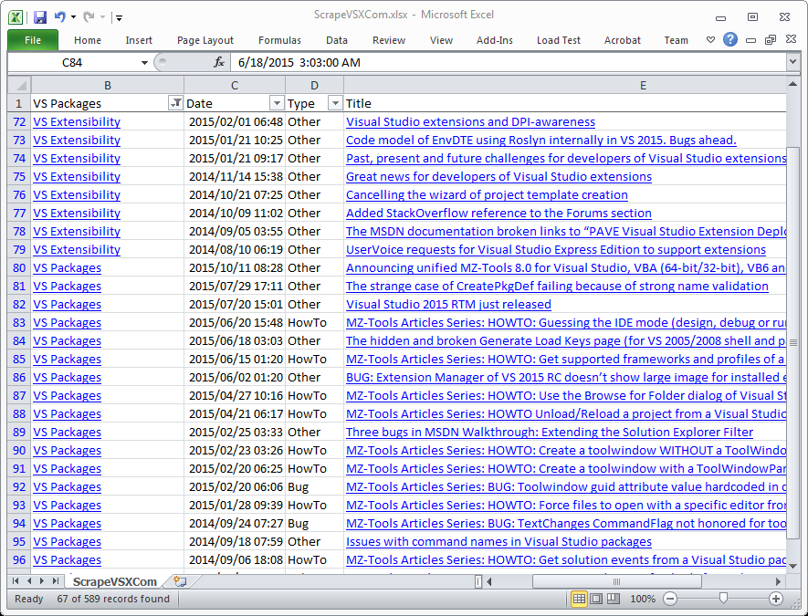

## VisualStudioExtensibility.com Article Meta-Information Scraper
---

[VisualStudioExtensibility.com](http://www.visualstudioextensibility.com/)
is a great website that contains a lot information on writing extensions
for Microsoft's Visual Studio. Unfortunately it isn't very easy to get a
quick overview of all the articles (490+ at the time of this writing).

`ScrapeVSXCom` is a command line program written in F# that scrapes
VisualStudioExtensibility.com and generates a
[tab-separated-values](https://en.wikipedia.org/wiki/Tab-separated_values),
file where each article line contains:

* Category
* Post date
* Title
* Type (HowTo, Bug, or Other)
* URL
* CategoryURL

This file can then be imported into Microsoft Excel, Google Sheet, etc. and
the articles filtered/sorted via any column.



This repo contains
[ScrapeVSXCom.csv](ScrapeVSXCom/ScrapeVSXCom.csv?raw=true) and
[ScrapeVSXCom.xlsx](ScrapeVSXCom/ScrapeVSXCom.xlsx?raw=true) files if you
want to see an example of the generated scraped data.

### Usage

To use, open `ScrapeVSXCom.sln` in Visual Studio 2013 and Build. Then open
a Command Prompt window and navigate to the `ScrapeVSXCom` project
sub-folder. Enter the following command:

```
    bin\Release\ScrapeVSXCom.exe
```
or
```
    bin\Debug\ScrapeVSXCom.exe
```

Various informational messages will be printed in the Command Prompt window
to show the progress of the program.

Two files are also generated:

* `ScrapeVSXCom.log` contains everything printed to the console, summary
  information on the articles (Category, Year, and Type), and all the
  articles listed by Category, Type, Month, and Title.

* `ScrapeVSXCom.csv` is the tab-separated-values file discussed above.

These two files are versioned so if you run the program multiple times an
existing `ScrapeVSXCom.log` will be renamed to `ScrapeVSXCom.1.log`,
`ScrapeVSXCom.1.log` to `ScrapeVSXCom.2.log`, etc up to
`ScrapeVSXCom.10.log`.

`ScrapeVSXCom` stores the downloaded pages in
`<SolutionDir>\ScrapeVSXCom\cache`. If you re-run the program it will read
from the local cache instead of downloading from
VisualStudioExtensibility.com again. To avoid this behavior you can simply
delete the entire `cache` directory or just
`<SolutionDir>\ScrapeVSXCom\cache\www.visualstudioextensibility.com\index.html`
and the months you want to re-download (Usually the current month is
enough).

<!--
   Local Variables:
   coding: utf-8
   mode: markdown
   mode: auto-fill
   indent-tabs-mode: nil
   sentence-end-double-space: t
   fill-column: 75
   standard-indent: 3
   tab-stop-list: (3 6 9 12 15 18 21 24 27 30 33 36 39 42 45 48 51 54 57 60)
   End:
-->
